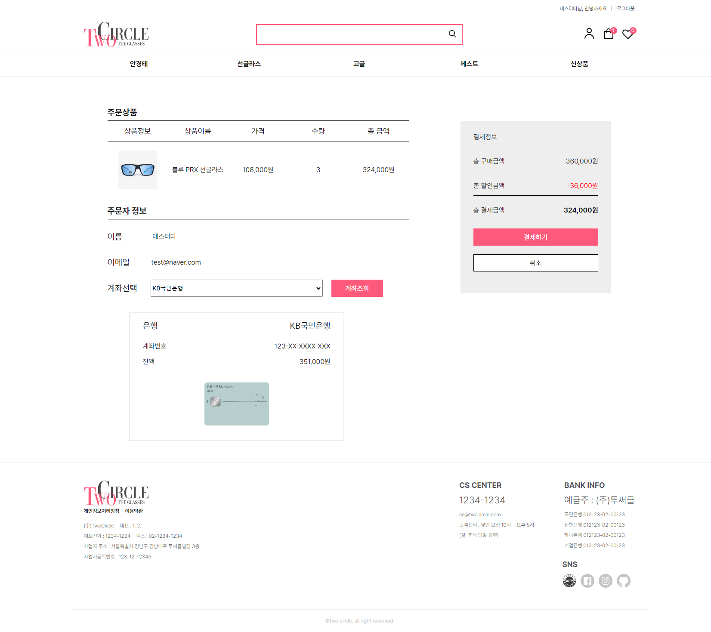
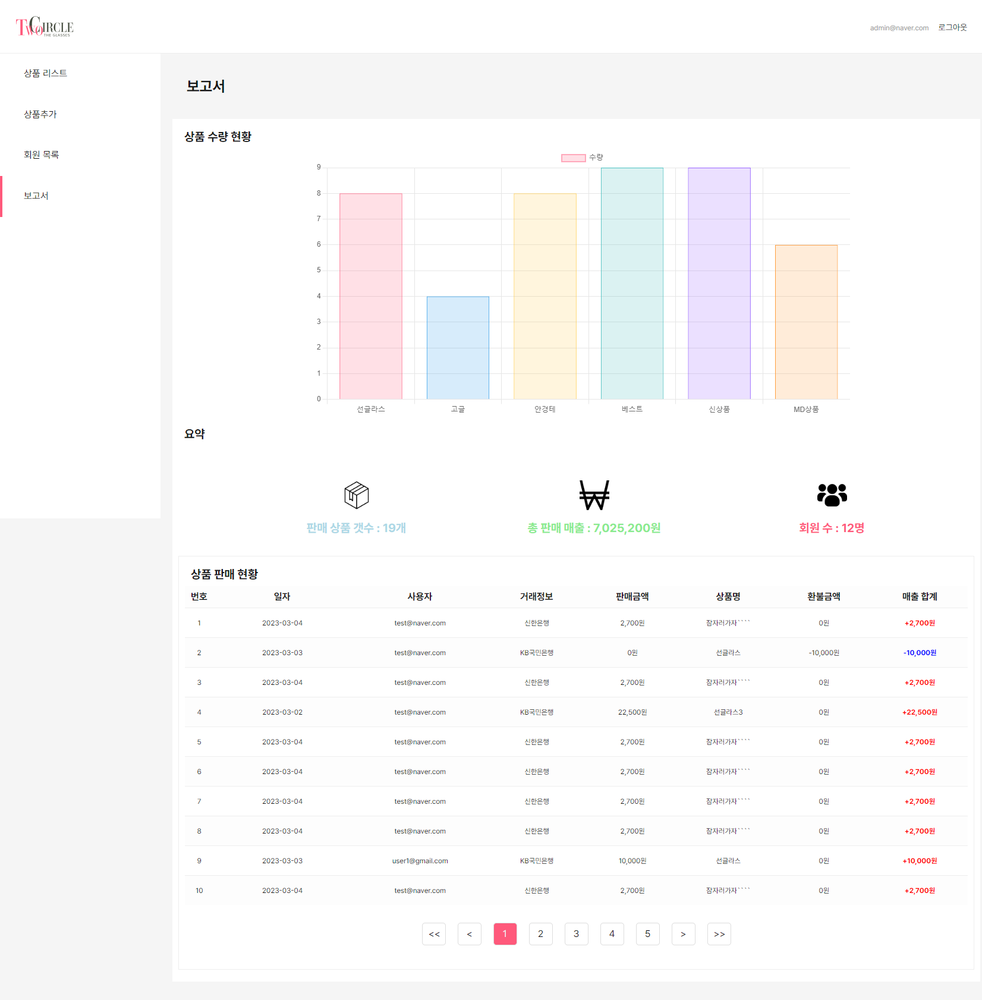
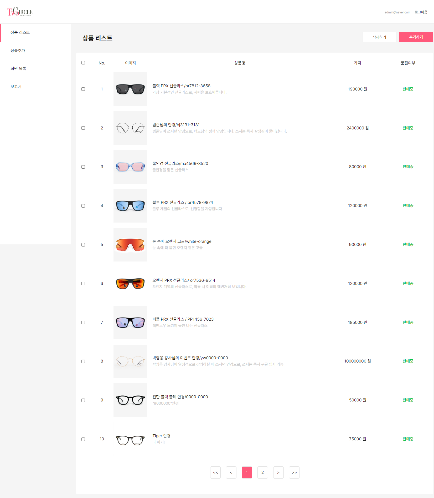

## 배포 사이트
[](https://app.netlify.com/sites/dapper-blancmange-23af79/deploys)
## 접속 링크
## **[TwoCircle](https://dapper-blancmange-23af79.netlify.app/)**
## TwoCircle 프로젝트 소개
REST API를 활용하여 Vanilla JavaScript로 제작한 안경 쇼핑몰입니다.
- 유저는 회원가입 및 로그인 후 상품 구매를 사용할 수 있으며 그 외 주문내역, 개인정보수정 등이 가능하고 계좌관리(계좌등록)을 통해 구매가 가능합니다.
- 관리자는 거래내역, 상품 등록, 등록 상품 내역을 볼 수 있고, 상품등록 및 수정, 거래취소 및 거래확정이 가능합니다.
- 404페이지 출력 시, 3초 뒤 메인화면으로 돌아갑니다
- 사용자가 배너에 있는 버튼을 통해 라이트 모드와 다크 모드를 선택 할 수 있습니다

## 사이트 소개
| 메인페이지(라이트)| 메인페이지(다크) |
|:---------:|:----------:|
|   |   |

| 제품 페이지| 결제 페이지 |
|:---------:|:----------:|
| |  |

| 관리자 대시보드| 관리자 상품 관리 |
|:---------:|:----------:|
| |  |
### 페이지 구성


### TwoCircle 작업과정
[TwoCircle Issues](https://github.com/TwoCircle-Team5/TwoCircle/issues)


### 작업기간
23.01.30 ~ 23.03.10

## 테스트 계정
### 사용자
ID : test@naver.com<br/>
PW : abcd1234
### 관리자
ID : admin@naver.com<br/>
PW : abcd1234

## 프로젝트 멤버 및 작업 목록

| <center>박희수<조장></center> | <center>김선미</center>|<center>송지윤</center>  | <center>장현준</center> | <center>박현준</center> |
|:--:|:--:|:--:|:--:|:--:|
|  |  |  |  |  |
| [박희수](https://github.com/Nevacat) | [김선미](https://github.com/seon-mikim)  |   [송지윤](https://github.com/jiyoon29)                     | [장현준](https://github.com/hyeon17)   | [박현준](https://github.com/johnphjkr)  |
| </br>라우터 연결 <br/> 로그인 및 회원가입 페이지 <br/> 검색 및 태그에 따른 상품페이지  |  장바구니 페이지  </br> 위시리스트</br> 마이페이지 </br> 계좌관리 페이지  | 메인페이지 <br/> 관리자 페이지 <br/> 전반적인 디자인 관리  |  제품 상세페이지 <br/> 결제 페이지 <br/> 결제 완료 페이지</br>  관리자 유저 목록 페이지 </br> 관리자 대시보드 페이지 </br> 404(NotFound)페이지 </br> 구매목록 페이지 구조 제작 및 디자인 </br> 카카오톡 공유하기 </br> API 구조 제작 </br> 라우터 구조 제작 </br> Wiki 작성 | 정보 변경 페이지 <br> 구매목록 페이지 |

### 프로젝트의 기능구현 사항

📌 필수사항
- [x] 제공된 API를 사용하여 해당하는 쇼핑몰을 구성하기.
- [x] 회원가입 페이지를 제작하여 회원가입 기능 구현하기.
- [x] 로그인 페이지를 제작하여 로그인 기능 구현하기.
- [x] 상품 리스트 페이지를 제작하여 상품 리스트 및 상세 페이지를 구현하여 상품 구매 기능 구현하기.
- [x] 장바구니 페이지를 제작하여 장바구니 기능 구현하기.
- [x] 주문 페이지를 제작하여 주문 기능 구현하기.
- [x] 마이페이지를 제작하여 마이페이지 기능 구현하기.
- [x] 검색 페이지를 제작하여 검색 및 필터를 통해 검색을 구현하기.

### 프로젝트 기술 스택

- Basic: `HTML` `SCSS` `JAVASCRIPT`
- Library: `node-fetch` `Parcel` `Swiper` `Navigo` `Netlify`
- Deploy: `Netlify`
- Bundler: `Parcel 1`

### 프로젝트 구조
```
TwoCircle
├─ image
├─ index.html
├─ LICENSE
├─ package-lock.json
├─ package.json
├─ pages
│  ├─ admin
│  │  ├─ admin_dashboard.js
│  │  ├─ admin_product_list.js
│  │  ├─ admin_userlist.js
│  │  ├─ product.js
│  │  ├─ product_add.js
│  │  └─ product_update.js
│  ├─ admin_wrap.js
│  ├─ header.js
│  ├─ notfound
│  │  └─ 404page.js
│  └─ user
│     ├─ account.js
│     ├─ cart.js
│     ├─ login.js
│     ├─ main.js
│     ├─ mypage.js
│     ├─ order_completed.js
│     ├─ password_check.js
│     ├─ payment.js
│     ├─ product_details.js
│     ├─ product_list.js
│     ├─ purchase_history.js
│     ├─ signup.js
│     ├─ user_information.js
│     └─ wish_list.js
├─ README.md
├─ scss
│  ├─ abstracts
│  ├─ admin
│  ├─ base
│  ├─ notfound
│  └─ user
├─ source
│  ├─ api
│  │  ├─ account
│  │  │  ├─ account_able_check.js
│  │  │  ├─ account_add.js
│  │  │  ├─ account_add_check.js
│  │  │  └─ account_delete.js
│  │  ├─ certified
│  │  │  ├─ authcheck_api.js
│  │  │  ├─ login_api.js
│  │  │  ├─ pw_check_api.js
│  │  │  ├─ signup_api.js
│  │  │  └─ userupdate_api.js
│  │  ├─ products
│  │  │  ├─ admin
│  │  │  │  ├─ allProduct_api.js
│  │  │  │  ├─ product.js
│  │  │  │  ├─ product_add.js
│  │  │  │  ├─ product_delete.js
│  │  │  │  ├─ product_transactions_api.js
│  │  │  │  ├─ product_update.js
│  │  │  │  └─ user_list_api.js
│  │  │  ├─ common
│  │  │  │  └─ product_detail_api.js
│  │  │  └─ user
│  │  │     ├─ payment_api.js
│  │  │     ├─ purchase_cancel_api.js
│  │  │     ├─ purchase_history_api.js
│  │  │     ├─ purchase_history_only_api.js
│  │  │     └─ purchase_ok_api.js
│  │  └─ requests.js
│  └─ js
│     ├─ 404page.js
│     ├─ account.js
│     ├─ admin
│     │  ├─ admin.js
│     │  ├─ admin_dashboard.js
│     │  ├─ admin_products_data.js
│     │  ├─ product.js
│     │  ├─ product_add.js
│     │  ├─ product_list.js
│     │  ├─ product_update.js
│     │  └─ user_list.js
│     ├─ bankImage.js
│     ├─ cart.js
│     ├─ event_badge.js
│     ├─ header.js
│     ├─ loading.js
│     ├─ login.js
│     ├─ main.js
│     ├─ order_completed.js
│     ├─ pagination.js
│     ├─ payment.js
│     ├─ product_details.js
│     ├─ product_list.js
│     ├─ purchase_history.js
│     ├─ pw_check.js
│     ├─ signup.js
│     ├─ user_info.js
│     └─ wish_list.js
└─ static
```

### 프로젝트 실행 방법
```
1. $ git clone https://github.com/TwoCircle-Team5/TwoCircle.git
2. $ cd TwoCircle-Team5
3. $ npm i
4. root경로에 .env 파일 생성 후, api관련 정보(API_KEY, ADMIN) 입력
5. $ npm run dev
```